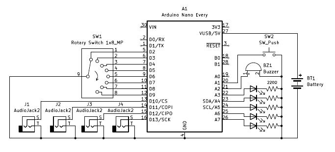

A tabletop timer for games where each player has a specific amount of time every turn.

Everyone has the same time for each turn. The timer resets to that time after every turn.

Usage
1. Turn on
2. Select a duration for turns
3. when the first player is ready to play, press the button
5. if the player presses the button before their time is up, the next player's time begins
6. if the player does not press the button before their time is up, a buzzer sounds and the timer sleeps
7. if the timer is sleeping, press the button to start the next turn
8. double press the button to pause, tap again to start the next turn
9. LEDs indicate the remaining duration
  Initial logic:

  |color|pin|min time remaining|max time remaining|
  |---|---|---|---|
  |blue|2|5/6*duration|1*duration|
  |green|3|4/6*duration|5/6*duration|
  |yellow|4|3/6*duration|4/6*duration|
  |orange|5|2/6*duration|3/6*duration|
  |red|6|1/6*duration|2/6*duration|
  |flashing red|6|0|1/6*duration|

Wiring schematic: 

Enclosure: 
