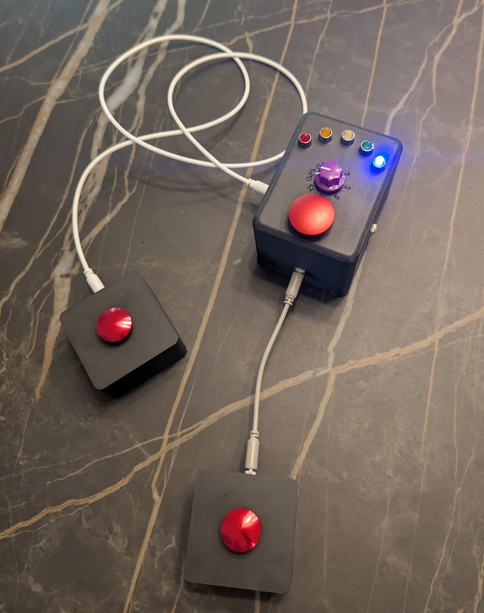

This is a single duration turn timer for tabletop games. It's like an hourglass without the slow reset.

Attribution:
* Code: 99% Gemini.
* Everything else: 99% me.

## Basic Usage

Everyone has the same time for each turn. The timer resets to that time after every turn.

1. Use the knob to Select a turn duration (t).
1. Turn on timer
1. Press a button: starts a timer
1. Player presses the button when their turn is complete, timer starts the next player's turn.
1. If the timer ends before a button is pressed, the device will beep and then sleep.
1. Double press the button to put the timer to sleep.
1. If the timer is sleeping, press the button to start the next turn
1. LEDs indicate the remaining duration in t/6 chunks. LED 1 lights for the first 1/6 of a turn, LED 2 lights for the second 1/6, and so on. LED 5 lights for the fifth chunk and then flashes for the final chunk.

## Details
* Wiring schematic: 
* TS jacks are used to hook up external buttons and are not really needed.
  
## Components
* Panel mount mushroom head buttons: [22mm](https://www.amazon.com/dp/B0CKV6B81P), [16mm (1)](https://www.sparkfun.com/16mm-metal-push-button-switch-mushroom-head-red.html), [16mm (2)](https://www.amazon.com/dp/B0FM3VK8YW)
* [Arduino Nano clone](https://www.amazon.com/dp/B0F6Y7GS4Q) / [Arduino Nano Every](https://www.sparkfun.com/arduino-nano-every.html)
* [3.5mm mono jacks](https://www.amazon.com/dp/B0CF9DQYQ6)
* [Buzzer](https://www.amazon.com/dp/B07VK1GJ9X)/[mini speaker](https://www.sparkfun.com/mini-speaker-pc-mount-12mm-2-048khz.html)
* [Battery holder](https://www.sparkfun.com/battery-holder-3xaa-with-cover-and-switch-bare-wire.html) - switch removed and replaced with something like [this one](https://www.sparkfun.com/mini-power-switch-spdt.html) glued to the enclosure.
* [LED holders](https://www.sparkfun.com/led-holder-5mm-chrome-finish.html)
* M2 x 4mm [heat set threaded inserts](https://www.amazon.com/dp/B0FD7DQS8Y)
* M2 x 5mm screws
* [Solderable breadboard](https://www.amazon.com/dp/B0B27XB69M)
